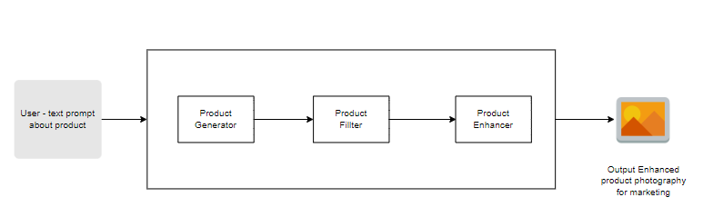
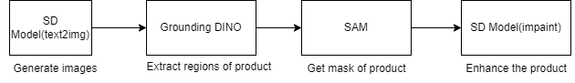
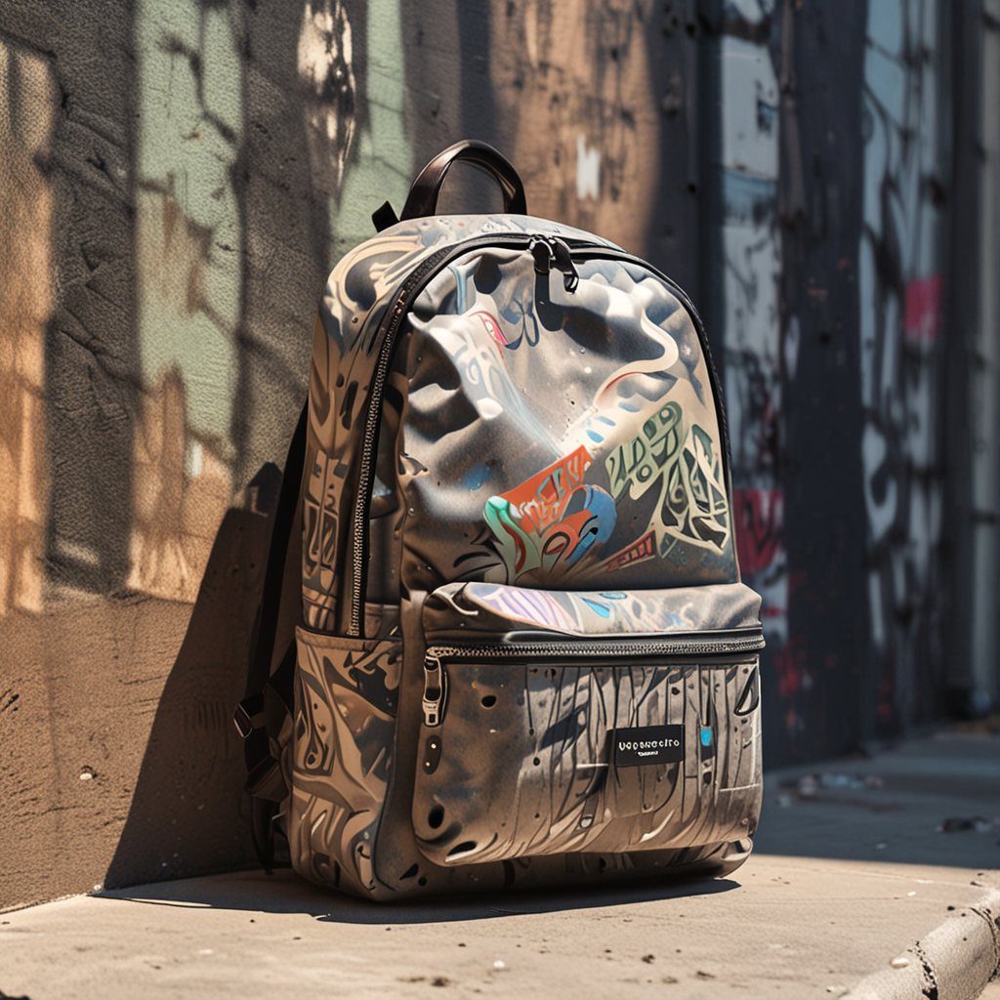
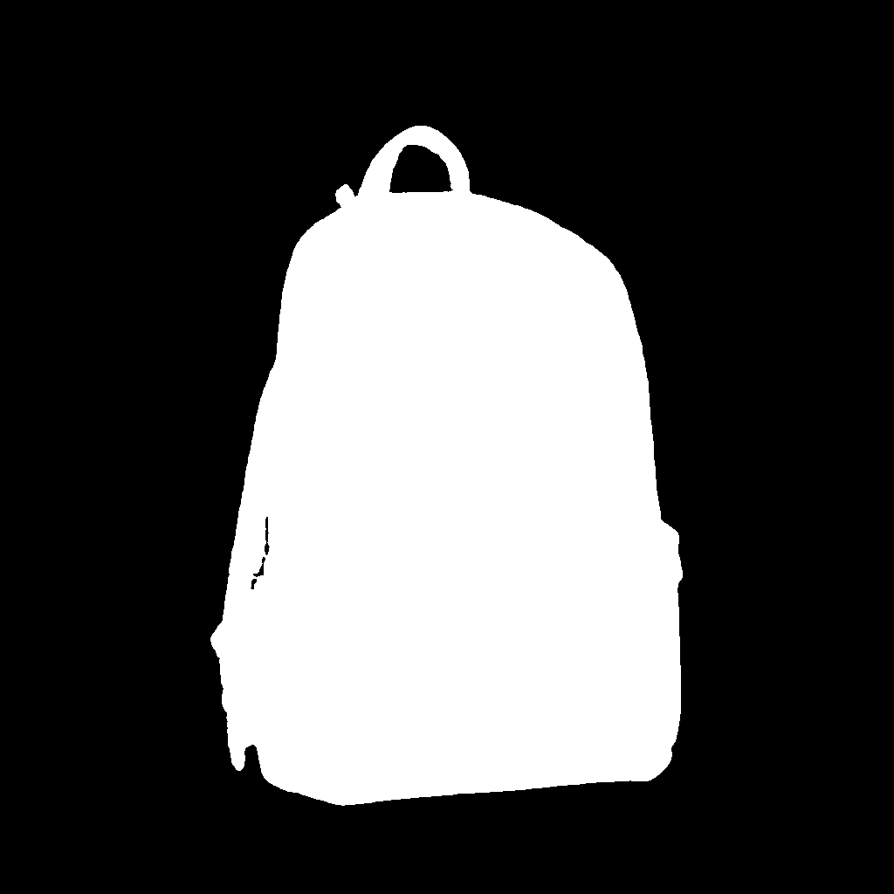
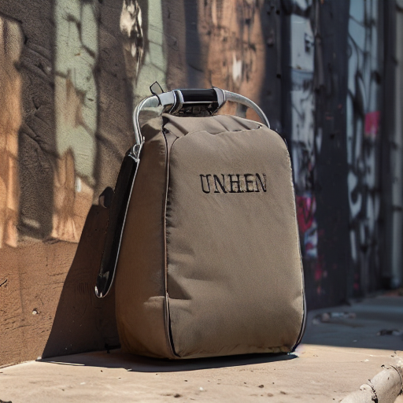

AI Product Photoshoot Visuals and Filter
==============================

The AI-Enhanced Product Photography Suite is a comprehensive solution for automating and optimizing the visual content creation process for e-commerce and marketing purposes

Project Organization
------------

    ├── LICENSE
    ├── Makefile           <- Makefile with commands like `make data` or `make train`
    ├── README.md          <- The top-level README for developers using this project.
    ├── notebooks          <- Jupyter notebooks. Naming convention is a number (for ordering),
    │                         the creator's initials, and a short `-` delimited description, e.g.
    │                         `1.0-jqp-initial-data-exploration`.
    │
    ├── references         <- Data dictionaries, manuals, and all other explanatory materials.
    │
    ├── reports            <- Generated analysis as HTML, PDF, LaTeX, etc.
    │   └── figures        <- Generated graphics and figures to be used in reporting
    │
    ├── requirements.txt   <- The requirements file for reproducing the analysis environment, e.g.
    │                         generated with `pip freeze > requirements.txt`
    │
    ├── setup.py           <- makes project pip installable (pip install -e .) so src can be imported
    ├── src                <- Source code for use in this project.
    │   ├── __init__.py    <- Makes src a Python module
    │   │
    │   ├── product_enhancer           <- Scripts to enhance the generated product
    │   │   └── enhance_product.py
    │   │
    │   ├── product_visuals       <- Scripts to generate product photography for marketing
    │   │   └── generate_products.py
    │   │
    │   ├── models         <- Scripts to train models and then use trained models to make
    │   │   │                 predictions
    │   │   ├── predict_model.py
    │   │   └── train_model.py
    │   │
    │   └── visualization  <- Scripts to create exploratory and results oriented visualizations
    │       └── visualize.py
    │
    └── tox.ini            <- tox file with settings for running tox; see tox.readthedocs.io


--------

## System Architecture







## How to Use?
1. Install the requirements
    ```commandline
   pip install -r requirements.txt
   ```
2. Run the product photography image generation - Modify 'configs/config.yml' as per use case
    ```
   python main.py
   ```
3. View the results generated as output
    ```
   cd visuals/product_photos ----> to view the generated product images
   cd visuals/impaint_results ----> to view the enhanced product images
   
   ```

## Sample Results

| Prompt |  Product | Product Mask | Enhanced Product |
|--------|----------|--------------|------------------ 
| Image of backpack placed on a graffiti wall, under the sun |  |  | |

## Other Links

Presentation - [Click Here](reports/Presentation.pdf)
Sample Results - [Click Here](https://drive.google.com/drive/folders/1LM9srq68CSwR5CCMYYypVaKtr-McZBvg?usp=sharing)
<p><small>Project based on the <a target="_blank" href="https://drivendata.github.io/cookiecutter-data-science/">cookiecutter data science project template</a>. #cookiecutterdatascience</small></p>
